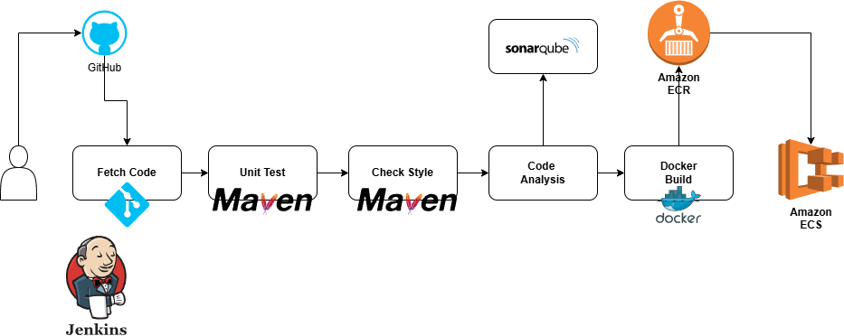

# Jenkins Pipeline for vProfile Project

This repository contains a Jenkins pipeline script to automate the build process for the vProfile project. The pipeline is designed to fetch the code, perform code analysis, run unit tests, build the project, and upload the generated artifact to Nexus.

---

## Architecture



## Pipeline Overview

The pipeline uses **Maven 3.9**, **JDK 17**, and **SonarQube** for analysis. It consists of the following stages:

### 1. **Fetch Code**
- **Description**: Clones the `atom` branch of the vProfile project from GitHub.
- **Command Used**:
  ```groovy
  git branch: 'atom', url: 'https://github.com/hkhcoder/vprofile-project.git'
  ```

### 2. **Build**
- **Description**: Builds the project and generates the `.war` artifact. Tests are skipped during this stage.
- **Command Used**:
  ```bash
  mvn install -DskipTests
  ```
- **Post Build Action**:
  - Archives the generated `.war` files for further use.
  - Command:
    ```groovy
    archiveArtifacts artifacts: '**/*.war'
    ```

### 3. **Unit Test**
- **Description**: Runs unit tests using Maven to ensure code quality.
- **Command Used**:
  ```bash
  mvn test
  ```

### 4. **Check Style Analysis**
- **Description**: Performs code style analysis using Maven Checkstyle.
- **Command Used**:
  ```bash
  mvn checkstyle:checkstyle
  ```

### 5. **Sonar Code Analysis**
- **Description**: Executes static code analysis using SonarQube Scanner.
- **Key Environment Variables**:
  - `sonar.projectKey`: vprofile
  - `sonar.sources`: src/
- **Command Used**:
  ```bash
  ${scannerHome}/bin/sonar-scanner \
  -Dsonar.projectKey=vprofile \
  -Dsonar.projectName=vprofile \
  -Dsonar.projectVersion=1.0 \
  -Dsonar.sources=src/ \
  -Dsonar.java.binaries=target/test-classes/com/visualpathit/account/controllerTest/ \
  -Dsonar.junit.reportsPath=target/surefire-reports \
  -Dsonar.jacoco.reportsPath=target/jacoco.excec \
  -Dsonar.java.checkstyle.reportsPath=target/checkstyle-result.xml
  ```

### 6. **Quality Gate**
- **Description**: Ensures the project meets SonarQube quality standards.
- **Command Used**:
  ```groovy
  waitForQualityGate abortPipeline: true
  ```

### 7. **Upload Artifact**
- **Description**: Uploads the generated `.war` artifact to Nexus.
- **Command Used**:
  ```groovy
  nexusArtifactUploader(
    nexusVersion: 'nexus3',
    protocol: 'http',
    nexusUrl: '172.31.28.254:8081',
    groupId: 'QA',
    version: "${env.BUILD_ID}-${env.BUILD_TIMESTAMP}",
    repository: 'vprofile-repo',
    credentialsId: 'nexuslogin',
    artifacts: [
        [artifactId: 'vproapp', classifier: '', file:'target/vprofile-v2.war', type: 'war']
    ]
  )
  ```

---

## Notifications

Slack notifications are sent upon pipeline completion with details about the build result. The messages are formatted based on the build status:
- **SUCCESS**: Green
- **FAILURE**: Red

### Slack Command Example:
```groovy
slackSend channel: '#devops',
color: COLOR_MAP [currentBuild.currentResult],
message: "*${currentBuild.currentResult}:* Job ${env.JOB_NAME} build ${env.BUILD_NUMBER} \n More Info at:"
```

---

## Prerequisites

Ensure the following tools are installed and configured on your Jenkins instance:

- **Maven 3.9**
- **JDK 17**
- **SonarQube Scanner 6.2**
- **Nexus 3**
- Slack integration for Jenkins

---

## Usage Instructions

1. **Setup the Jenkins Pipeline**:
   - Copy the pipeline script into a Jenkins pipeline project.
   - Configure the required tools (Maven, JDK, SonarQube, and Nexus) in Jenkins global tools configuration.

2. **Run the Pipeline**:
   - Trigger the pipeline to execute the stages sequentially as described above.

---

## Repository Details

- **GitHub URL**: [vProfile Project](https://github.com/hkhcoder/vprofile-project.git)
- **Branch Used**: `atom`

---

## Output Artifacts

The pipeline generates the following artifacts:
- **WAR File**: Available in the Jenkins workspace as `target/vprofile-v2.war` after a successful build.

---
